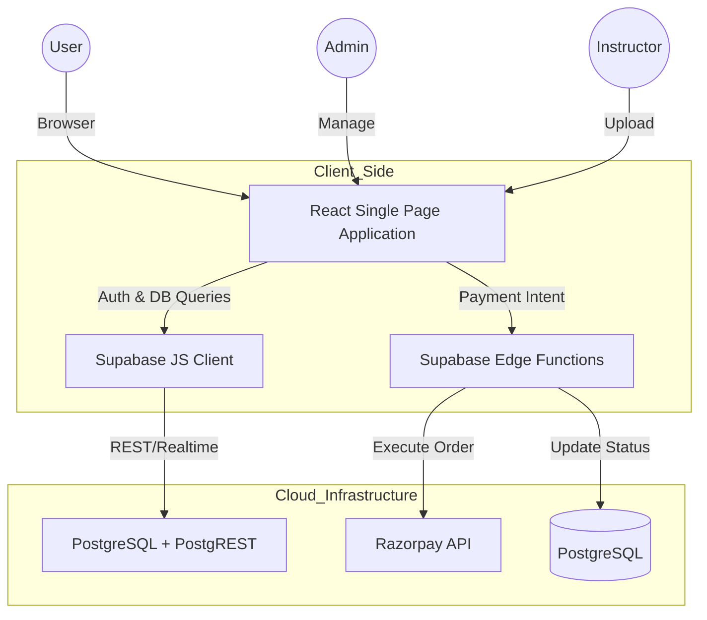

# 🎓 WebBeetles - Premium Multi-Role LMS Platform

[](https://react.dev/)
[](https://vitejs.dev/)
[](https://supabase.com/)
[](https://tailwindcss.com/)
[](https://opensource.org/licenses/MIT)

**WebBeetles** is a market-ready, high-performance Learning Management System (LMS) designed for a seamless educational experience. Built with a modern tech stack focusing on scalability, security, and a premium user interface, it offers tailored portals for Students, Instructors, and Administrators.

---

## 🚀 Key Features

### 👤 Student Portal
- **Course Discovery:** Dynamic course catalog with advanced filtering and category-based exploration.
- **Interactive Learning:** seamless video playback and resource management.
- **Cart & Checkout:** Robust shopping cart system with multi-course enrollment.
- **Secure Payments:** Integrated with **Razorpay** for seamless transactions (Order creation, verification, and cancellation flows).
- **Personalized Dashboard:** Track learning progress, orders, and certificates.

### 👨‍🏫 Instructor Portal
- **Course Management:** Comprehensive tools for creating, updating, and publishing courses.
- **Profile & Credentialing:** Detailed instructor onboarding with professional verification.
- **Performance Analytics:** Real-time stats on student enrollment and course revenue.
- **Quick Action Navigation**: Linked the "View Certificates" quick action to open the "My Courses" tab.

---

## 4. Premium Certificate & Stamp Refinements
- **Student Name Scaling**: Reduced the font size of the student name inside [CertificateModal.jsx](file:///c:/Users/Subhradeep%20Nath/OneDrive/Desktop/New%20folder%20(6)/WebBeetles/src/components/student/dashboard/student-myCourse/course-details/CertificateModal.jsx) from a large `text-6xl` to a more proportional, elegant `text-2xl sm:text-3xl lg:text-4xl` font serif size to balance the visual layout.
- **Detailed Course Description & Curriculum Badges**: Added a structured description explaining key curriculum competencies and dynamic badges (40 Hours Coursework, Graded Assessments, Hands-on Projects) to enrich the certificate with academic depth.
- **Authentic Stamp & Seal**: Implemented a CSS and SVG vector-based official gold foil seal featuring:
  - Scalloped outer borders and inner dashed rings.
  - A circular text path showing "WebBeetles Academy • Official Seal •".
  - A central laurel wreath starburst with "EST. 2024" branding.
  - Classic red ribbons extending below the seal with a V-cut finish.
- **Scannable Verification QR Code**: Added a scannable QR code generated from a public endpoint that maps directly to the guest verification URL, allowing verification using any scanner or mobile phone camera.
- **Verification Portal Sync**: Updated [CertificateVerification.jsx](file:///c:/Users/Subhradeep%20Nath/OneDrive/Desktop/New%20folder%20(6)/WebBeetles/src/pages/student/certificate/CertificateVerification.jsx) to render the exact same premium certificate design, ensuring a consistent brand experience when credentials are verified online.

---

### 🛠️ Admin Dashboard
- **Universal Oversight:** Manage students, instructors, and platform-wide settings.
- **Course Moderation:** Approval workflow for maintaining quality control.
- **Advanced Analytics:** Data-driven insights into platform growth, registration trends, and top-performing categories.
- **System Configuration:** Maintenance mode toggles, fee management, and notification broadcasts.

---

## 🛠️ Tech Stack

### Frontend
- **Framework:** React 19 (Vite)
- **Styling:** Tailwind CSS 4, Chakra UI (for consistent design tokens)
- **Animations:** GSAP, Framer Motion, Lottie-React (for premium micro-interactions)
- **State Management:** Redux Toolkit, Zustand, React Query (TanStack)
- **UI Components:** Lucide Icons, Swiper.js, React-Toastify

### Backend & Infrastructure
- **BaaS:** Supabase (Auth, PostgreSQL, Storage)
- **Serverless:** Supabase Edge Functions (Deno) for secure payment logic.
- **Payments:** Razorpay Integration.
- **Deployment:** Vercel (Frontend & Edge Functions).

---

## 🏗️ System Architecture



---

## 📦 Getting Started

### Prerequisites
- Node.js (v18+)
- npm or yarn
- Supabase Account

### Installation

1. **Clone the repository:**
   ```bash
   git clone https://github.com/SubhradeepNathGit/Product-CRUD.git
   cd WebBeetles
   ```

2. **Install dependencies:**
   ```bash
   npm install
   ```

3. **Environment Setup:**
   Create a `.env` file in the root directory and add your credentials:
   ```env
   VITE_SUPABASE_URL=your_supabase_url
   VITE_SUPABASE_ANON_KEY=your_supabase_anon_key
   ```

4. **Run the development server:**
   ```bash
   npm run dev
   ```

---

## 📂 Project Structure

```text
src/
├── api/            # API configurations and Axios instances
├── components/     # Reusable UI components (Student/Instructor/Admin)
├── layout/         # Persistent layouts (Navbars, Footers, Sidbars)
├── pages/          # Main route components grouped by role
├── redux/          # Global state management
├── routing/        # Centralized React Router configuration
├── supabase/       # Edge functions and migration configs
└── util/           # Helper functions and Supabase client setup
```

---

## 🛡️ Role-Based Access Control (RBAC)

The application implements a strict RBAC policy:
- **Guest:** Browse courses and static pages.
- **Student:** Access dashboard, purchase courses, and view enrolled content.
- **Instructor:** Access instructor-specific dashboard and management tools.
- **Admin:** Full access to system analytics, user management, and content moderation.

---

## 📄 License

This project is licensed under the MIT License - see the [LICENSE](LICENSE) file for details.

---


