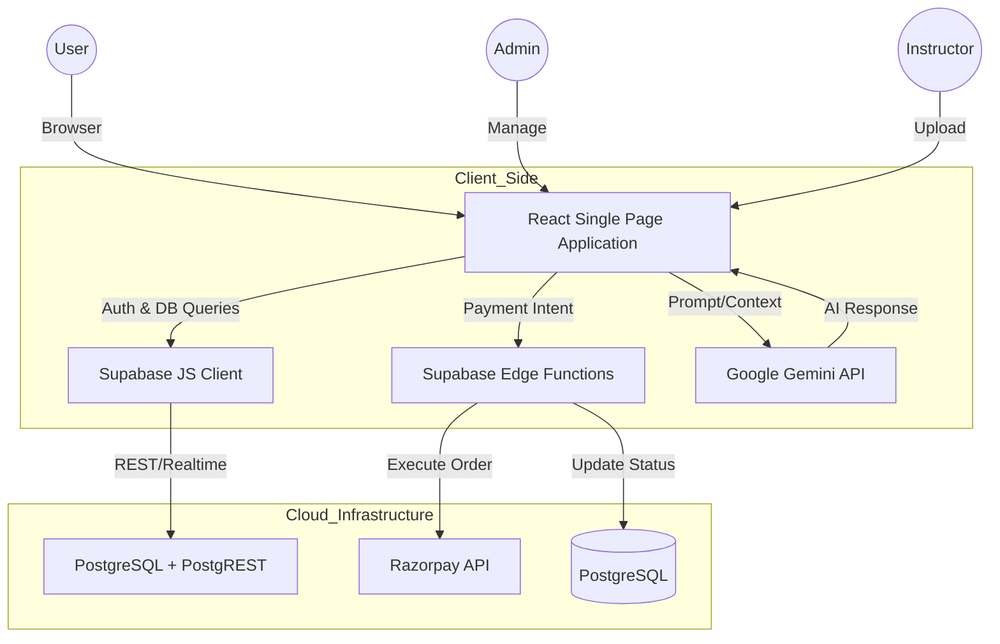

# WebBeetles - Premium AI-Integrated Online Course Marketplace

[](https://react.dev/)
[](https://vitejs.dev/)
[](https://supabase.com/)
[](https://tailwindcss.com/)
[](https://deepmind.google/technologies/gemini/)
[](https://opensource.org/licenses/MIT)

**WebBeetles** is a market-ready, high-performance Learning Management System (LMS) revolutionized by cutting-edge artificial intelligence. Built with a modern tech stack focusing on scalability, enterprise-grade security, and a premium user interface, it offers fully tailored portals for Students, Instructors, and Administrators. By natively integrating **Google Gemini AI**, WebBeetles delivers intelligent, context-aware automation and an unparalleled, next-generation educational experience.

---

## 🚀 Key Features & Capabilities

### 🤖 AI-Integrated Experience (Powered by Google Gemini)
- **Intelligent Chatbot:** An advanced, context-aware support bot driven by the Google Gemini API. It provides automated, real-time assistance, answers complex course inquiries, guides platform navigation, and resolves issues directly within the student dashboard.
- **Smart Automation:** Reduces support overhead by autonomously handling common student queries, simulating a 24/7 human-like teaching assistant.

### 👤 Student Portal
- **Course Discovery & Enrollment:** Dynamic course catalog with advanced filtering, category-based exploration, and personalized recommendations.
- **Interactive Learning Environment:** Seamless video playback, comprehensive resource management, and rich text lessons (`CourseContent.jsx`, `CourseDetails.jsx`).
- **Optimized Checkout & Cart System:** 
  - Robust shopping cart functionality (`CartItemCard.jsx`, `PaymentSummaryCard.jsx`).
  - Trust Badges and Security components to ensure high conversion rates (`TrustBadage.jsx`, `SecurityTrust.jsx`).
  - Contextual action headers and support modals for friction-free purchasing.
- **Personalized Dashboard:** Track learning progress, historical orders, and view comprehensive performance statistics (`StudentDashboardStats.jsx`).
- **Premium Certifications:** Generates highly detailed, printable PDF certificates upon course completion, featuring authentic vector gold stamps, scannable QR verification codes, and scaled typography (`CertificateModal.jsx`).

### 👨‍🏫 Instructor Portal
- **Course Management Suite:** Comprehensive tools for creating, updating, structuring, and publishing courses directly from the web dashboard.
- **Enhanced Dashboard Analytics:** Modernized interface (`InstructorDashboardHeader.jsx`) providing high-level summaries and quick action navigation.
- **Profile & Credentialing:** Detailed instructor onboarding with professional verification and portfolio management.
- **Performance & Revenue Tracking:** Real-time financial statistics and enrollment tracking managed through a global Redux store (`instructorSlice.js`).

### 🛠️ Administrator Control Center
- **Universal Oversight & Analytics:** Extensive charts and data tables detailing platform growth, user engagement, and revenue (`Analytics.jsx`).
- **Course Moderation Workflow:** Dedicated approval pipelines (`ApproveCourses.jsx`) ensuring only high-quality content reaches the marketplace.
- **Financial & Platform Settings:** Granular control over commission rates, payment gateway configurations (`Charges.jsx`), and system maintenance toggles (`Settings.jsx`).
- **User Management:** Full CRUD capabilities for student and instructor accounts, including review management (`InstructorReviews.jsx`).

### 💳 Backend & Infrastructure
- **Secure Payments:** Deep integration with **Razorpay** for seamless financial transactions.
- **Serverless Verification:** Utilizes Deno-based Supabase Edge Functions (`verify-payment/index.ts`) for cryptographic signature verification, preventing tampering and securely updating PostgreSQL order states.

---

## 🛠️ Technology Stack

### Frontend Architecture
- **Core Framework:** React 19 optimized with Vite
- **Styling & UI:** Tailwind CSS 4, Chakra UI (for consistent design tokens)
- **Animations & Micro-interactions:** GSAP, Framer Motion, Lottie-React, Swiper.js
- **State Management:** Redux Toolkit, Zustand, TanStack React Query
- **Forms & Validation:** React Hook Form
- **Icons & Notifications:** Lucide React, React-Toastify, SweetAlert2, Notistack

### AI & Backend Services
- **Artificial Intelligence:** Google Gemini API (for advanced chatbot and natural language processing)
- **Backend-as-a-Service (BaaS):** Supabase (Authentication, PostgreSQL Database, Object Storage)
- **Serverless Compute:** Supabase Edge Functions (Deno)
- **Payment Gateway:** Razorpay
- **Email Delivery:** EmailJS Integration

---

## 🏗️ System Architecture



---

## 📦 Getting Started

### Prerequisites
- Node.js (v18 or higher)
- npm or yarn package manager
- Supabase Account & Project
- Razorpay Account
- Google Gemini API Key

### Installation & Setup

1. **Clone the repository:**
   ```bash
   git clone https://github.com/SubhradeepNathGit/Product-CRUD.git
   cd WebBeetles
   ```

2. **Install dependencies:**
   ```bash
   npm install
   ```

3. **Environment Configuration:**
   Create a `.env` file in the root directory and add the necessary configuration keys:
   ```env
   # Supabase
   VITE_SUPABASE_URL=your_supabase_url
   VITE_SUPABASE_ANON_KEY=your_supabase_anon_key

   # Payments (Razorpay)
   VITE_RAZORPAY_KEY_ID=your_razorpay_key
   VITE_CREATE_ORDER_URL=your_edge_function_url

   # AI Integration
   VITE_GEMINI_API_KEY=your_google_gemini_api_key

   # Email Service
   VITE_EMAILJS_SERVICE_ID=your_emailjs_service_id
   VITE_EMAILJS_TEMPLATE_ID=your_emailjs_template_id
   VITE_EMAILJS_PUBLIC_KEY=your_emailjs_public_key
   ```

4. **Start the development server:**
   ```bash
   npm run dev
   ```

---

## 🛡️ Role-Based Access Control (RBAC)

WebBeetles implements strict data segregation and routing based on user roles:
- **Guest:** Browse the public catalog, view course details, and access static pages.
- **Student:** Access personalized dashboards, interact with the AI Chatbot, purchase courses, and view enrolled video content.
- **Instructor:** Access dedicated management tools to build courses, track revenue, and monitor student progress.
- **Administrator:** Full, unrestricted access to system analytics, financial controls, and content moderation pipelines.

---

## 📄 License

This project is licensed under the MIT License - see the [LICENSE](LICENSE) file for details.
